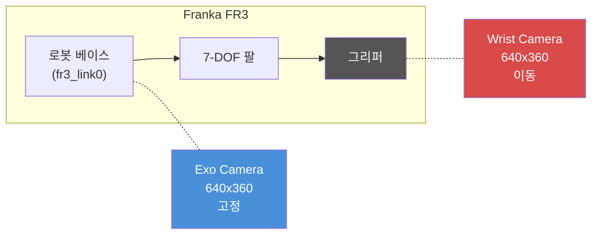
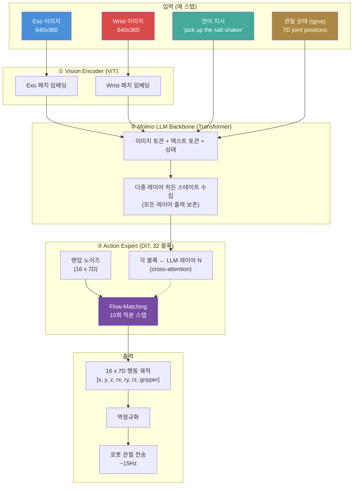
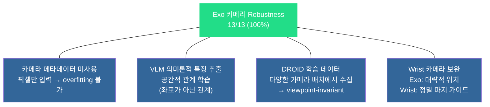

# 카메라 시스템 분석 노트

**날짜:** 2026-04-13
**관련 레포트:** REPORT_KR.md 섹션 6 (카메라 Robustness)

---

## 1. 2-카메라 구조

MolmoBot-DROID는 매 스텝마다 **두 대의 카메라 이미지**를 입력으로 받는다.

| | Exo Camera (외부) | Wrist Camera (손목) |
|---|---|---|
| **장착 위치** | 로봇 베이스 (`fr3_link0`) — 고정 | 그리퍼 (`gripper/wrist_camera`) — 이동 |
| **역할** | 씬 전체 파악, 오브젝트 위치 인식 | 근접 파지 시 정밀 가이드 |
| **움직임** | 고정 (로봇 동작과 무관) | 엔드이펙터와 함께 이동 |
| **해상도** | 640×360 | 640×360 |

## 2. 이미지 → 로봇 동작 파이프라인

- **7D 행동**: `[x, y, z, rx, ry, rz, gripper]` — 위치 델타 + 그리퍼 개폐
- **Flow-matching**: 랜덤 노이즈에서 시작, 10회 적분 스텝으로 유효한 행동 궤적 생성
- **Action Expert**의 각 블록은 LLM의 **서로 다른 레이어** 출력을 cross-attention으로 수신 → 다중 스케일 씬 이해

## 3. Exo 카메라 Robustness 100%의 이유

카메라 robustness 테스트 (13/13, 100%) 결과의 원인 분석:

1. **모델에 카메라 외부 파라미터가 입력되지 않음** — 픽셀만 입력하므로 특정 카메라 위치에 overfitting 불가
2. **VLM의 의미론적 특징 추출** — ViT가 픽셀 좌표가 아닌 공간적 관계("소금통이 그릇 왼쪽에 있다")를 학습
3. **학습 데이터(DROID)의 다양한 카메라 배치** — 다양한 실제 환경에서 수집되어 viewpoint-invariant 특징 학습
4. **Wrist 카메라의 보완 역할** — Exo가 대략적 위치를 잡고, 최종 파지는 wrist 카메라가 정밀 가이드. Exo 시점이 약간 바뀌어도 wrist 카메라가 일관된 근접 뷰 제공

## 4. 향후 실험 제안

- **Wrist 카메라 robustness 테스트**: Exo보다 영향이 클 가능성 높음 (파지 정밀도에 직접 관여)
- **단일 카메라 ablation**: Exo only vs Wrist only 성능 비교
- **카메라 극한 테스트**: ±20cm, ±20° 이상에서 성능 경계 확인
