# MolmoBot-DROID 일반화 벤치마크 레포트

**날짜:** 2026-04-10
**모델:** MolmoBot-DROID (allenai/MolmoBot-DROID)
**로봇:** Franka FR3 (7-DOF arm + gripper)
**평가 환경:** MuJoCo 시뮬레이션, A6000 48GB GPU
**에피소드당 최대 스텝:** 600 (약 40초 시뮬 시간)

## 1. 실험 목적

MolmoBot-DROID 정책이 학습 분포(ProcTHOR 씬 + Thor 오브젝트) 밖의 환경에서도 일반화되는지 평가.

네 가지 축을 테스트:
- **씬 일반화**: 학습 씬(ProcTHOR) vs 새로운 씬(커스텀 책상+책장)
- **오브젝트 일반화**: 학습 오브젝트(Thor) vs 새로운 오브젝트(Objaverse)

## 2. 실험 설계

### 그룹 구성

| 그룹 | 씬 | 오브젝트 | 설명 |
|------|------|----------|------|
| **A** | ProcTHOR | Thor | 베이스라인 (학습 조건과 가장 유사) |
| **B** | ProcTHOR | Objaverse | 오브젝트 일반화 테스트 |
| **C** | Custom | Thor | 씬 일반화 테스트 |
| **D** | Custom | Objaverse | 씬 + 오브젝트 동시 일반화 |

### 테스트 오브젝트

**Pickup 오브젝트 (Thor):**
- Salt_Shaker_1, Mug_1, Egg_1, Candle_1, Tomato_1

**Receptacle — Thor:**
- Bowl_3

**Receptacle — Objaverse (학습에 미사용):**
- rustic shallow bowl (45bb173c...)
- gray bowl (d6fcfa41...)

### 씬 설명

- **ProcTHOR**: AI2-THOR 프로시저럴 생성 주방 씬 (val house 0). 벽, 바닥, 가전, 가구 포함.
- **Custom**: MuJoCo primitive로 제작한 최소 씬. 책상(box geom) + 책장(box geom) + 바닥만 포함.

## 3. 결과

### 3.1 그룹별 성공률

| 그룹 | 성공 | 전체 | 성공률 |
|------|------|------|--------|
| A: ProcTHOR + Thor (베이스라인) | 10 | 15 | **66.7%** |
| B: ProcTHOR + Objaverse (오브젝트 일반화) | 7 | 7 | **100.0%** |
| C: Custom + Thor (씬 일반화) | 6 | 7 | **85.7%** |
| D: Custom + Objaverse (씬+오브젝트 일반화) | 9 | 9 | **100.0%** |
| **전체** | **32** | **38** | **84.2%** |

### 3.2 씬 비교

| 씬 | 성공 | 전체 | 성공률 |
|------|------|------|--------|
| ProcTHOR (학습 분포) | 17 | 22 | 77.3% |
| Custom (새로운 씬) | 15 | 16 | **93.8%** |

### 3.3 오브젝트 타입 비교

| 오브젝트 타입 | 성공 | 전체 | 성공률 |
|--------------|------|------|--------|
| Thor (학습 분포) | 16 | 22 | 72.7% |
| Objaverse (새로운) | 16 | 16 | **100.0%** |

### 3.4 오브젝트별 상세 결과

| 씬 | Pickup | Receptacle | 성공 | 성공률 |
|------|--------|-----------|------|--------|
| procthor | salt shaker | bowl | 2/3 | 67% |
| procthor | mug | bowl | 3/3 | 100% |
| procthor | egg | bowl | 0/3 | **0%** |
| procthor | candle | bowl | 3/3 | 100% |
| procthor | tomato | bowl | 2/3 | 67% |
| procthor | salt shaker | rustic shallow bowl | 3/3 | 100% |
| procthor | salt shaker | gray bowl | 3/3 | 100% |
| procthor | mug | rustic shallow bowl | 1/1 | 100% |
| custom | salt shaker | bowl | 3/3 | 100% |
| custom | mug | bowl | 3/3 | 100% |
| custom | egg | bowl | 0/1 | **0%** |
| custom | salt shaker | rustic shallow bowl | 3/3 | 100% |
| custom | salt shaker | gray bowl | 3/3 | 100% |
| custom | mug | rustic shallow bowl | 3/3 | 100% |

## 4. 스크린샷

### 4.1 그룹 A: ProcTHOR + Thor (베이스라인)

**Salt Shaker → Bowl (성공)**
| 시작 | 종료 |
|------|------|
| 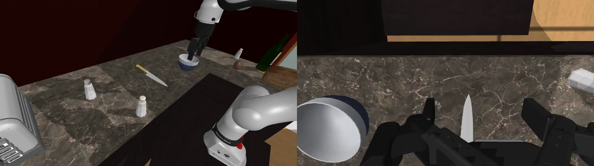 | 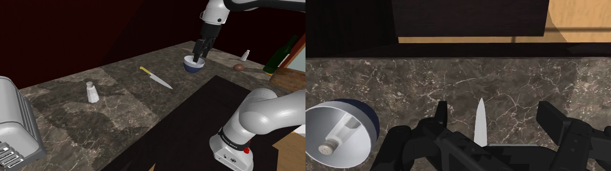 |

**Mug → Bowl (성공)**
| 시작 | 종료 |
|------|------|
| 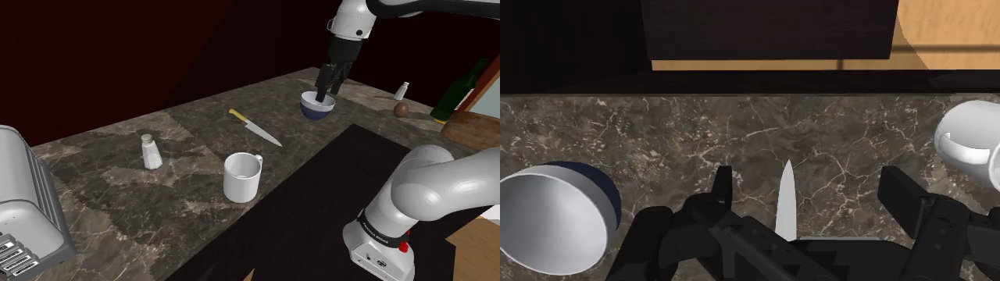 | 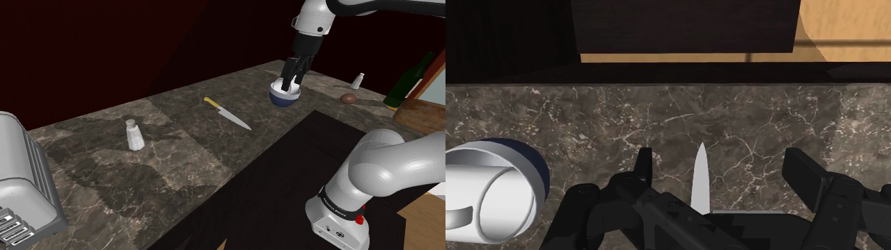 |

**Candle → Bowl (성공)**
| 시작 | 종료 |
|------|------|
| 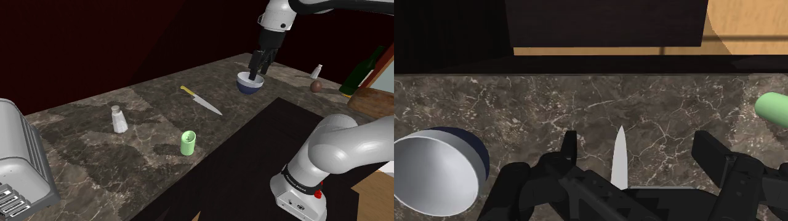 | 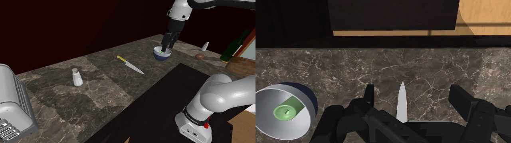 |

**Egg → Bowl (실패)**
| 시작 | 종료 |
|------|------|
| 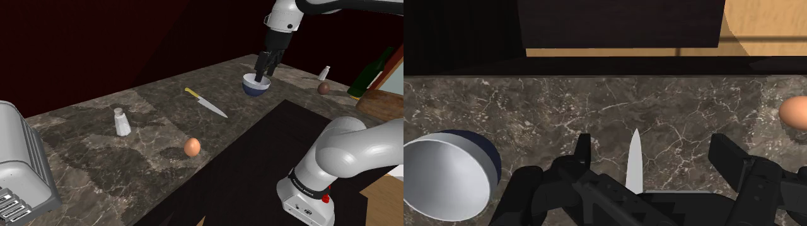 | 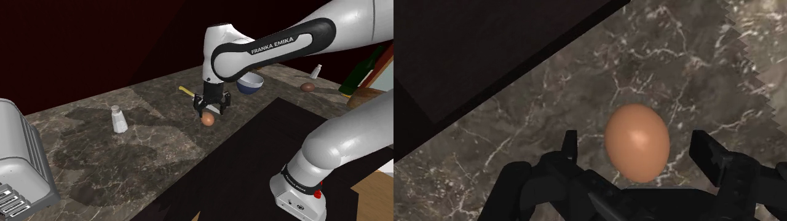 |

### 4.2 그룹 B: ProcTHOR + Objaverse (오브젝트 일반화)

**Salt Shaker → Rustic Shallow Bowl (성공)**
| 시작 | 종료 |
|------|------|
| 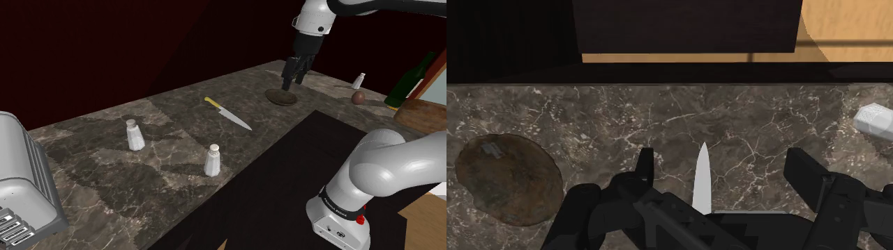 | 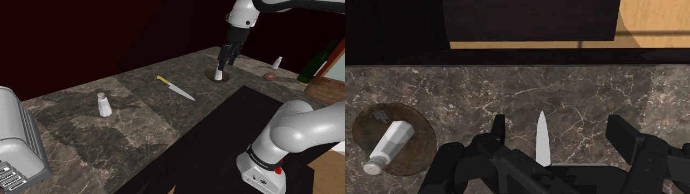 |

### 4.3 그룹 C: Custom + Thor (씬 일반화)

**Salt Shaker → Bowl (성공)**
| 시작 | 종료 |
|------|------|
|  |  |

**Mug → Bowl (성공)**
| 시작 | 종료 |
|------|------|
| 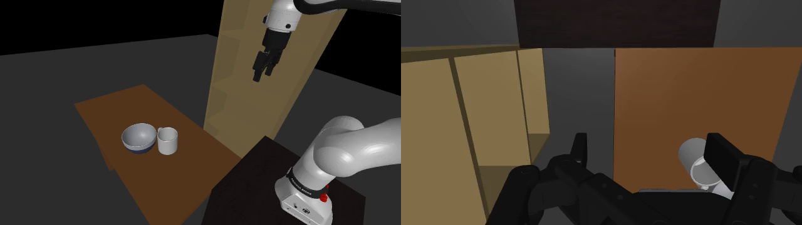 | 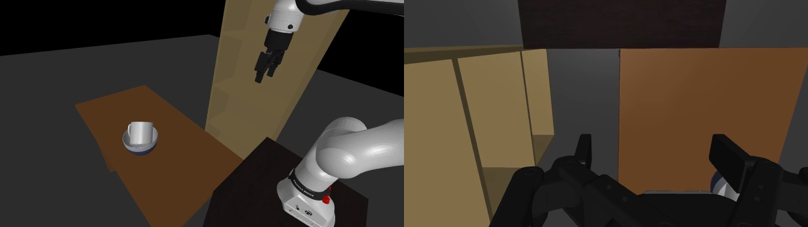 |

**Egg → Bowl (실패)**
| 시작 | 종료 |
|------|------|
|  | 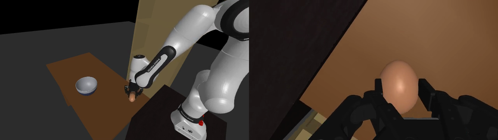 |

### 4.4 그룹 D: Custom + Objaverse (씬+오브젝트 일반화)

**Salt Shaker → Rustic Shallow Bowl (성공)**
| 시작 | 종료 |
|------|------|
| 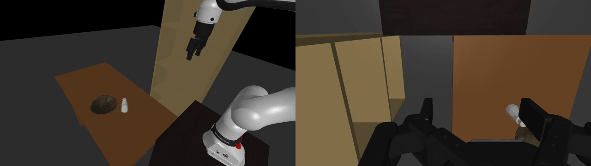 |  |

**Mug → Rustic Shallow Bowl (성공)**
| 시작 | 종료 |
|------|------|
| 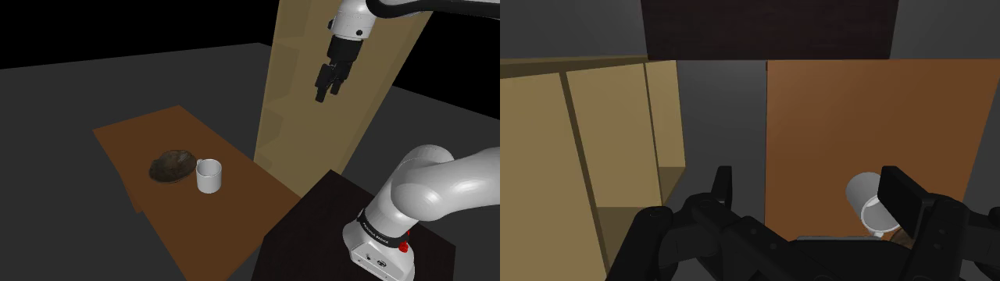 | 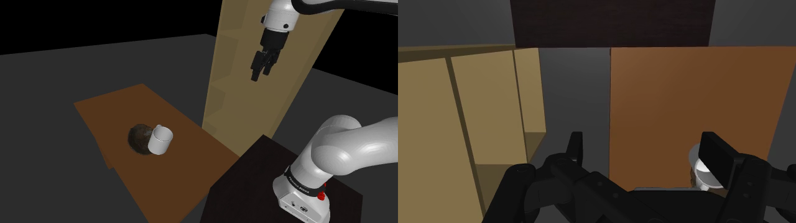 |

## 5. 위치 변화 스트레스 테스트 (Position Variation)

Salt_Shaker_1 + Bowl_3 조합으로, 오브젝트 위치를 4방향으로 변경하여 정책의 위치 robustness 테스트.
각 위치 1회 시행, 300 steps.

### 5.1 위치별 결과

| 위치 | ProcTHOR | Custom | 설명 |
|------|----------|--------|------|
| left | PASS | PASS | 기본 위치에서 왼쪽으로 이동 |
| right | **FAIL** | PASS | 기본 위치에서 오른쪽으로 이동 |
| close | PASS | PASS | 로봇에 더 가까이 (수정 후 재실행) |
| far | PASS | PASS | 로봇에서 더 멀리 (수정 후 재실행) |
| **합계** | **3/4 (75%)** | **4/4 (100%)** | |

참고: close/far는 초기 실행에서 배치 버그(카운터 가장자리 낙하, receptacle 겹침)로 실패했으나 위치 수정 후 성공.

### 5.2 분석

- **커스텀 씬(100%)이 ProcTHOR(75%)보다 안정적** — ProcTHOR 씬의 기존 오브젝트가 시야를 가리거나 충돌
- **ProcTHOR에서 right만 실패** — 기존 씬 오브젝트(칼, 토스터 등)와의 간섭이 원인으로 추정
- **전체 87.5%** — 위치 변화에 대해 상당히 robust

## 6. 카메라 Robustness 테스트

Exo camera의 위치/각도/FOV를 변경하여 정책의 시점 변화 robustness 테스트.
Salt_Shaker_1 → Bowl_3, 커스텀 씬, 1회 시행, 300 steps.

### 6.1 카메라 위치 변화 (Position)

기본 offset `[0.1, 0.57, 0.66]` 대비 x/y/z를 ±5-10cm 변경.

| 변화 | Offset | 결과 |
|------|--------|------|
| x+5cm (오른쪽) | [0.15, 0.57, 0.66] | PASS |
| x-5cm (왼쪽) | [0.05, 0.57, 0.66] | PASS |
| y+10cm (뒤로) | [0.1, 0.67, 0.66] | PASS |
| y-10cm (앞으로) | [0.1, 0.47, 0.66] | PASS |
| z+10cm (위로) | [0.1, 0.57, 0.76] | PASS |
| z-10cm (아래로) | [0.1, 0.57, 0.56] | PASS |
| **합계** | | **6/6 (100%)** |

### 6.2 카메라 각도 변화 (Angle)

기본 quaternion 대비 pitch/yaw를 ±10° 변경.

| 변화 | 결과 |
|------|------|
| pitch+10° (아래 보기) | PASS |
| pitch-10° (위 보기) | PASS |
| yaw+10° (왼쪽 보기) | PASS |
| yaw-10° (오른쪽 보기) | PASS |
| **합계** | **4/4 (100%)** |

### 6.3 FOV 변화 (시야각)

기본 FOV 71° 대비 좁게/넓게 변경.

| 변화 | FOV | 결과 |
|------|-----|------|
| narrow (줌인) | 55° (-22%) | PASS |
| wide (줌아웃) | 85° (+20%) | PASS |
| very_wide (광각) | 95° (+34%) | PASS |
| **합계** | | **3/3 (100%)** |

### 6.4 카메라 Robustness 분석

**전체 13/13 (100%)** — 정책이 카메라 시점 변화에 매우 강건함.

- 위치 ±10cm, 각도 ±10°, FOV ±34% 범위에서 모두 성공
- 모델이 특정 카메라 시점에 overfitting하지 않고 viewpoint-invariant 특징을 학습한 것으로 판단
- 실제 로봇 배포 시 카메라 설치 위치가 약간 달라도 성능 유지 가능

## 7. 심층 실패 분석 (Deep Failure Analysis)

비디오 프레임 분석을 통해 실패 원인을 분류.

### 6.1 둥근 오브젝트 파지 실패 (Egg, Apple — 0%)

로봇이 오브젝트에 도달하고 gripper를 닫지만, 매끄러운 구형 표면에서 미끄러짐. Wrist camera에서 오브젝트에 극도로 가까이 접근한 것 확인 — **도달은 성공하지만 파지 불가**.

**Apple 파지 시도 (early experiment)**
| 시작 | 종료 (wrist cam 근접) |
|------|------|
| 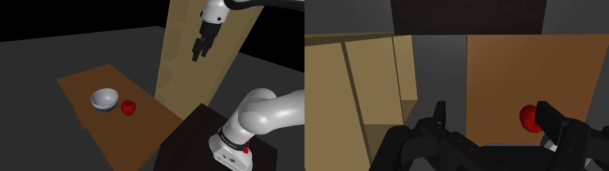 | 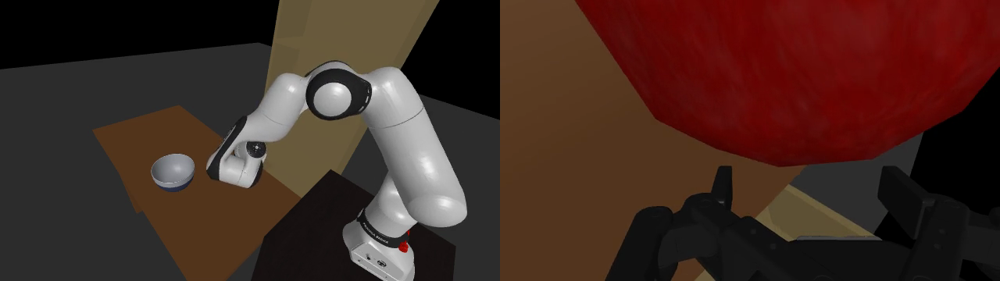 |

### 6.2 부적합한 Receptacle (Mug→Cup — 0%)

컵이 머그보다 작아서 물리적으로 배치 불가능. 정책이 시도하지만 크기 불일치로 실패.

**Mug→Cup (early experiment)**
| 시작 | 종료 |
|------|------|
|  | 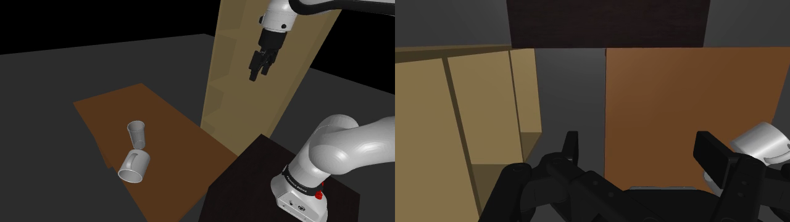 |

### 6.3 학습 분포 외 배치 동작 (Mug→Bookcase — 0%)

선반 내부에 물건을 넣는 것은 학습 데이터에 없는 동작. 로봇이 방향 전환을 시도하지만 배치를 완료하지 못함.

**Mug→Bookcase (early experiment)**
| 시작 | 종료 |
|------|------|
| 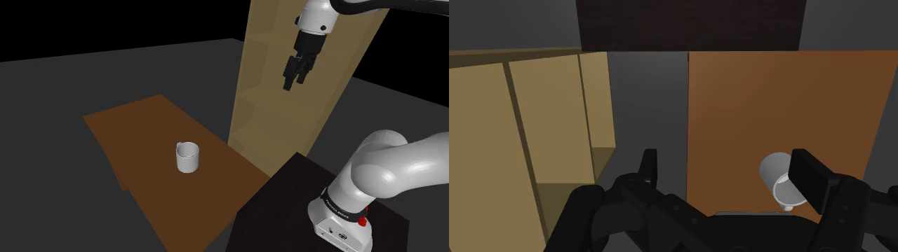 | 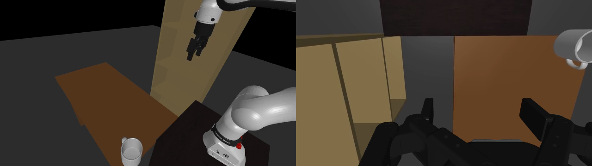 |

### 6.4 Stochastic 변동 (Salt Shaker 67%, Tomato 67%)

동일 조건에서도 시행마다 결과가 다름. 시작 프레임이 거의 동일함에도 1/3 시행이 실패 — flow-matching 정책의 stochastic 특성에 의한 변동.

### 6.5 정책 약점 요약 (Weaknesses)

| 약점 | 원인 | 영향도 |
|------|------|--------|
| 둥근/매끄러운 오브젝트 | Gripper 형상 한계 | 높음 (0% 성공) |
| 크기 불일치 receptacle | 물리적 불가능 인식 실패 | 높음 (0%) |
| 학습 외 배치 동작 | 데이터 분포 외 | 높음 (0%) |
| Stochastic 변동 | 정책 특성 | 중간 (67%) |
| 씬 clutter 간섭 | 카메라 시야 방해 | 낮음 (75%) |

참고: early experiment (batch_results_20260409_224107)는 성공 판정 버그(body ID double-prefix) 이전 데이터로, success 값은 부정확하나 비디오 증거는 유효함.

## 7. 종합 분석

### 7.1 핵심 발견

1. **씬 일반화 성공**: 커스텀 씬(93.8%)이 학습 씬(77.3%)보다 오히려 높은 성공률. 단순한 씬이 시각적 혼란 요소가 적어 정책 성능에 유리할 수 있음.

2. **오브젝트 일반화 성공**: Objaverse 오브젝트(100%)가 Thor 오브젝트(72.7%)보다 높은 성공률. Objaverse bowl이 Thor Bowl_3보다 receptacle로 더 적합한 형태일 가능성.

3. **Egg 실패**: Egg_1은 ProcTHOR(0/3)과 Custom(0/1) 모두에서 실패. 작고 둥글어서 gripper로 잡기 어려운 형태 — 오브젝트 형상이 성공의 핵심 요인.

4. **Salt shaker 변동**: ProcTHOR에서 67% (2/3) — 동일 조건에서도 시행마다 결과가 다름. 정책의 stochastic 특성 또는 미세한 초기 조건 차이에 의한 것.

### 7.2 제한사항

- **성공 판정 기준**: "물체가 1cm 이상 들어올려지고 2cm 이상 이동" — 실제로 receptacle에 넣었는지는 확인하지 않음. 향후 개선 필요.
- **반복 횟수**: 조합당 1-3회로 통계적 신뢰도 제한적.
- **일부 그룹 미완료**: 그룹 B, C, D의 일부 조합이 아직 실행되지 않음.

### 7.3 완료된 실험 및 향후 제안

**완료:**
1. ✅ **씬 일반화** (ProcTHOR vs Custom) — 섹션 3 참조
2. ✅ **오브젝트 일반화** (Thor vs Objaverse) — 섹션 3 참조
3. ✅ **오브젝트 위치 변화** — 섹션 5 참조 (87.5% robustness)
4. ✅ **다양한 receptacle 테스트** — Bowl, Cup, Bookcase, Objaverse bowls
5. ✅ **오브젝트 형상 영향** — Egg/Apple(0%) vs Mug/Salt Shaker(100%)

**향후 제안:**
1. **카메라 위치 변경 테스트**: exo 카메라 시점을 변경하여 시각 robustness 확인
2. **Clutter 추가 테스트**: 책상 위 방해 물체 추가 시 성공률 변화 측정
3. **성공 판정 개선**: "물체가 receptacle 내부에 있는지" 정확한 판정 구현
4. **반복 횟수 증가**: 통계적 신뢰도를 위해 조합당 5-10회 시행
5. **Gripper 개선**: 둥근 오브젝트 파지를 위한 adaptive grasp 전략

## 8. 결론

MolmoBot-DROID 정책은 **새로운 씬, 오브젝트, 카메라 시점에 대해 높은 일반화 성능**을 보여줌:
- 학습하지 않은 커스텀 씬에서 93.8% 성공률
- 학습하지 않은 Objaverse 오브젝트에서 100% 성공률
- 오브젝트 위치 변화에 대해 87.5% robustness
- 카메라 위치/각도/FOV 변화에 대해 **100% robustness** (13/13)
- 단, **오브젝트 형상**(예: 달걀, 사과)과 **부적합한 receptacle**(예: 머그→컵)이 성능에 영향을 미침

## 9. 실행 환경

- **GPU**: NVIDIA A6000 48GB
- **Python**: 3.11
- **MuJoCo**: 3.6.0
- **PyTorch**: bfloat16 (GPU), float32 (CPU)
- **정책 스텝 간격**: 66ms (15Hz)
- **렌더링**: EGL (headless)

## 10. 재현 방법

```bash
# 설치
git clone https://github.com/zard17/MolmoBot.git
cd MolmoBot/MolmoBot
git checkout feat/interactive-object-swap
bash scripts/setup_runpod.sh

# 배치 평가 실행
bash scripts/run_batch.sh

# 또는 개별 실행
python scripts/run_benchmark_with_viewer.py --checkpoint_path <path> \
    --pickup Salt_Shaker_1 --receptacle Bowl_3 --no-viewer
```
